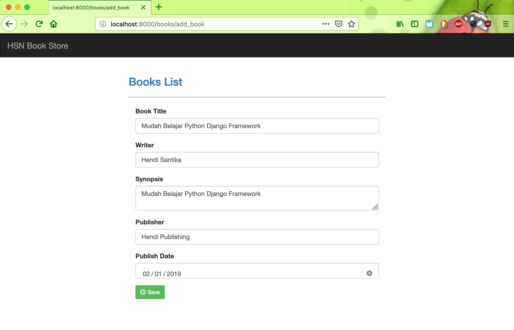

# DjangoBooks

#### Running Locally
```bash
git clone https://github.com/hendisantika/DjangoBooks.git
```
```bash
pip install -r requirements.txt
```
```bash
python manage.py migrate
```
```bash
python manage.py runserver
```

#### Screen shot

##### Home Page


##### Add new data



##### Update Data


##### List All Books

